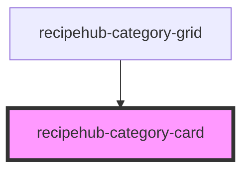

# recipehub-category-card

<!-- Auto Generated Below -->

## Properties

| Property      | Attribute     | Description | Type     | Default |
| ------------- | ------------- | ----------- | -------- | ------- |
| `categoryId`  | `category-id` |             | `string` | `''`    |
| `description` | `description` |             | `string` | `''`    |
| `imageSrc`    | `image-src`   |             | `string` | `''`    |
| `name`        | `name`        |             | `string` | `''`    |

## Events

| Event            | Description | Type                  |
| ---------------- | ----------- | --------------------- |
| `categorySelect` |             | `CustomEvent<string>` |

## Dependencies

### Used by

 - [recipehub-category-grid](../recipehub-category-grid)

### Graph

----------------------------------------------

*Built with [StencilJS](https://stenciljs.com/)*
