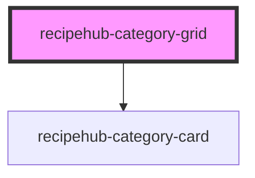

# recipehub-category-grid

<!-- Auto Generated Below -->

## Properties

| Property     | Attribute    | Description | Type     | Default |
| ------------ | ------------ | ----------- | -------- | ------- |
| `categories` | `categories` |             | `string` | `''`    |

## Events

| Event            | Description | Type                  |
| ---------------- | ----------- | --------------------- |
| `categorySelect` |             | `CustomEvent<string>` |

## Dependencies

### Depends on

- [recipehub-category-card](../recipehub-category-card)

### Graph

----------------------------------------------

*Built with [StencilJS](https://stenciljs.com/)*
