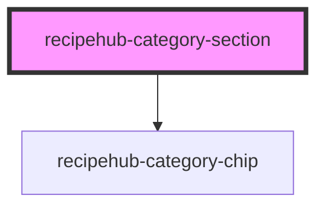

# recipehub-category-section

<!-- Auto Generated Below -->

## Properties

| Property        | Attribute        | Description | Type      | Default                |
| --------------- | ---------------- | ----------- | --------- | ---------------------- |
| `categories`    | `categories`     |             | `string`  | `''`                   |
| `categoryTitle` | `category-title` |             | `string`  | `'Explore Categories'` |
| `showViewMore`  | `show-view-more` |             | `boolean` | `true`                 |
| `visibleCount`  | `visible-count`  |             | `number`  | `6`                    |

## Events

| Event            | Description | Type                  |
| ---------------- | ----------- | --------------------- |
| `categorySelect` |             | `CustomEvent<string>` |
| `viewMore`       |             | `CustomEvent<void>`   |

## Dependencies

### Depends on

- [recipehub-category-chip](../recipehub-category-chip)

### Graph

----------------------------------------------

*Built with [StencilJS](https://stenciljs.com/)*
