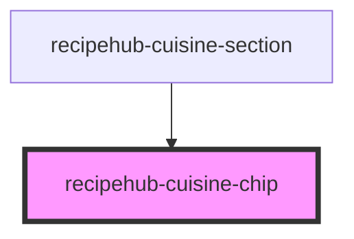

# recipehub-cuisine-chip

<!-- Auto Generated Below -->

## Properties

| Property      | Attribute | Description | Type            | Default                                                         |
| ------------- | --------- | ----------- | --------------- | --------------------------------------------------------------- |
| `cuisineData` | --        |             | `RecipeCuisine` | `{     id: '',     name: '',     area: '',     country: ''   }` |

## Events

| Event           | Description | Type                         |
| --------------- | ----------- | ---------------------------- |
| `cuisineSelect` |             | `CustomEvent<RecipeCuisine>` |

## Dependencies

### Used by

 - [recipehub-cuisine-section](../recipehub-cuisine-section)

### Graph

----------------------------------------------

*Built with [StencilJS](https://stenciljs.com/)*
