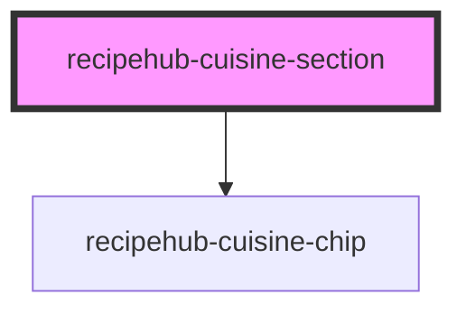

# recipehub-cuisine-section

<!-- Auto Generated Below -->

## Properties

| Property       | Attribute        | Description | Type      | Default              |
| -------------- | ---------------- | ----------- | --------- | -------------------- |
| `cuisineTitle` | `cuisine-title`  |             | `string`  | `'Explore Cuisines'` |
| `cuisines`     | `cuisines`       |             | `string`  | `''`                 |
| `showViewMore` | `show-view-more` |             | `boolean` | `true`               |
| `visibleCount` | `visible-count`  |             | `number`  | `6`                  |

## Events

| Event           | Description | Type                         |
| --------------- | ----------- | ---------------------------- |
| `cuisineSelect` |             | `CustomEvent<RecipeCuisine>` |
| `viewMore`      |             | `CustomEvent<void>`          |

## Dependencies

### Depends on

- [recipehub-cuisine-chip](../recipehub-cuisine-chip)

### Graph

----------------------------------------------

*Built with [StencilJS](https://stenciljs.com/)*
