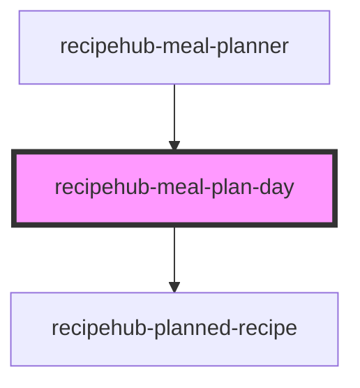

# recipehub-meal-plan-day

<!-- Auto Generated Below -->

## Properties

| Property              | Attribute               | Description | Type                                                                                       | Default    |
| --------------------- | ----------------------- | ----------- | ------------------------------------------------------------------------------------------ | ---------- |
| `date`                | `date`                  |             | `string`                                                                                   | `''`       |
| `dayName`             | `day-name`              |             | `"Friday" \| "Monday" \| "Saturday" \| "Sunday" \| "Thursday" \| "Tuesday" \| "Wednesday"` | `'Sunday'` |
| `meals`               | `meals`                 |             | `string`                                                                                   | `'[]'`     |
| `placeholderImageSrc` | `placeholder-image-src` |             | `string`                                                                                   | `''`       |

## Events

| Event          | Description | Type                           |
| -------------- | ----------- | ------------------------------ |
| `addRecipe`    |             | `CustomEvent<string>`          |
| `recipeSelect` |             | `CustomEvent<MealPlanItem>`    |
| `removeRecipe` |             | `CustomEvent<RemoveMealEvent>` |

## Dependencies

### Used by

 - [recipehub-meal-planner](../recipehub-meal-planner)

### Depends on

- [recipehub-planned-recipe](../recipehub-planned-recipe)

### Graph

----------------------------------------------

*Built with [StencilJS](https://stenciljs.com/)*
