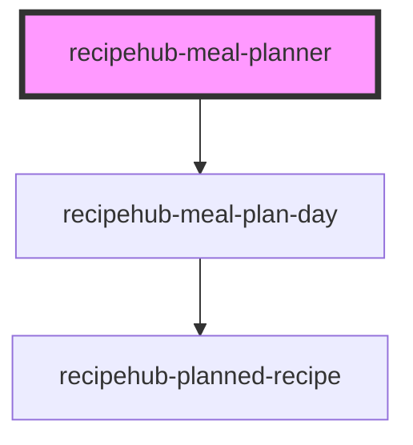

# recipehub-meal-planner

<!-- Auto Generated Below -->

## Properties

| Property              | Attribute               | Description | Type     | Default |
| --------------------- | ----------------------- | ----------- | -------- | ------- |
| `days`                | `days`                  |             | `string` | `'[]'`  |
| `placeholderImageSrc` | `placeholder-image-src` |             | `string` | `''`    |
| `weekLabel`           | `week-label`            |             | `string` | `''`    |

## Events

| Event          | Description | Type                           |
| -------------- | ----------- | ------------------------------ |
| `addRecipe`    |             | `CustomEvent<string>`          |
| `nextWeek`     |             | `CustomEvent<void>`            |
| `previousWeek` |             | `CustomEvent<void>`            |
| `recipeSelect` |             | `CustomEvent<MealPlanItem>`    |
| `removeRecipe` |             | `CustomEvent<RemoveMealEvent>` |

## Dependencies

### Depends on

- [recipehub-meal-plan-day](../recipehub-meal-plan-day)

### Graph

----------------------------------------------

*Built with [StencilJS](https://stenciljs.com/)*
