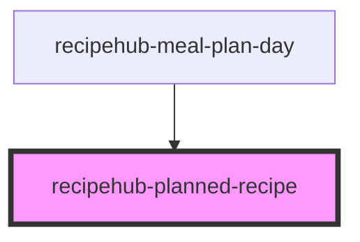

# recipehub-planned-recipe

<!-- Auto Generated Below -->

## Properties

| Property              | Attribute               | Description | Type     | Default |
| --------------------- | ----------------------- | ----------- | -------- | ------- |
| `placeholderImageSrc` | `placeholder-image-src` |             | `string` | `''`    |
| `recipe`              | `recipe`                |             | `string` | `''`    |

## Events

| Event          | Description | Type                        |
| -------------- | ----------- | --------------------------- |
| `recipeSelect` |             | `CustomEvent<MealPlanItem>` |
| `removeRecipe` |             | `CustomEvent<string>`       |

## Dependencies

### Used by

 - [recipehub-meal-plan-day](../recipehub-meal-plan-day)

### Graph

----------------------------------------------

*Built with [StencilJS](https://stenciljs.com/)*
